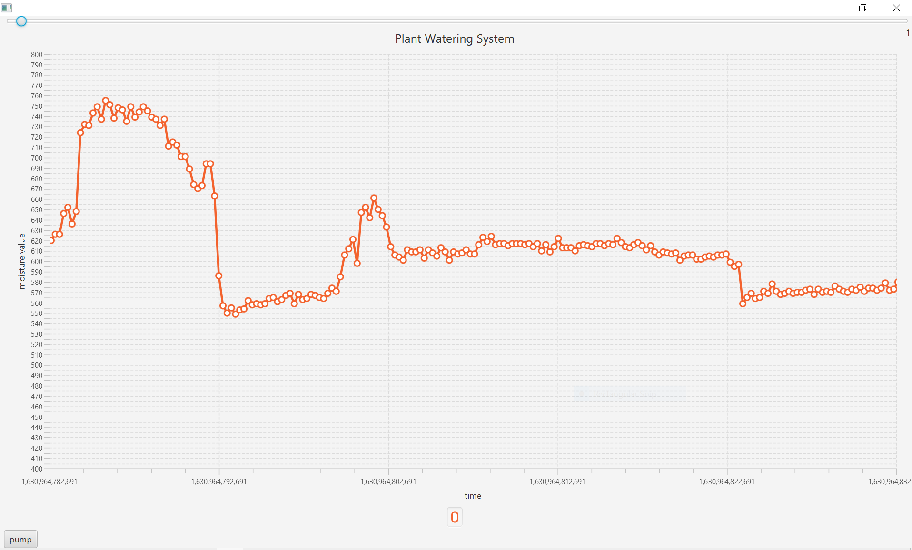
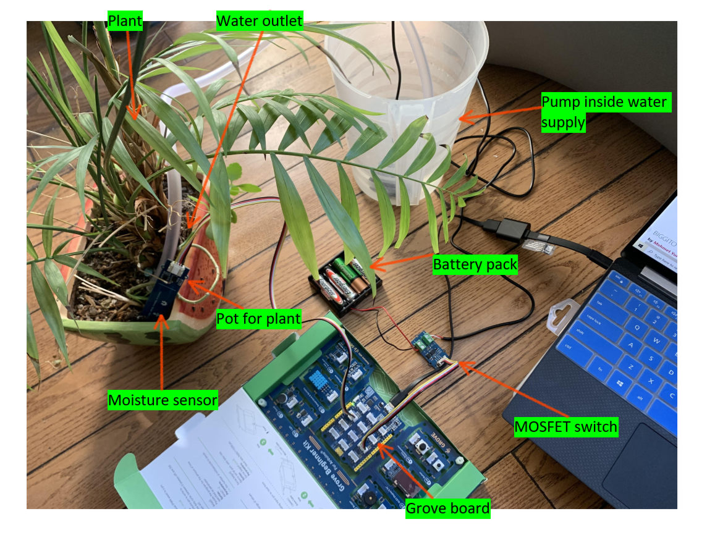

# Plant-Watering-System
Uses and Arduino UNO board and moisture sensor to automaticaly dispense water to plant based on coded moisture levels
Also opens a GUI where user can manually turn on water pump regardless if the soil is dry or wet. You can also press the button on the board to turn on the pump.
The GUI also displays a graph displaying data from the moisture sensor

  ## Image of GUI
  

  ## Diagram
  
  

  

  
